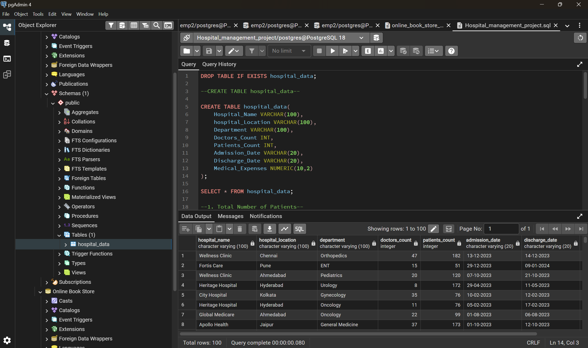
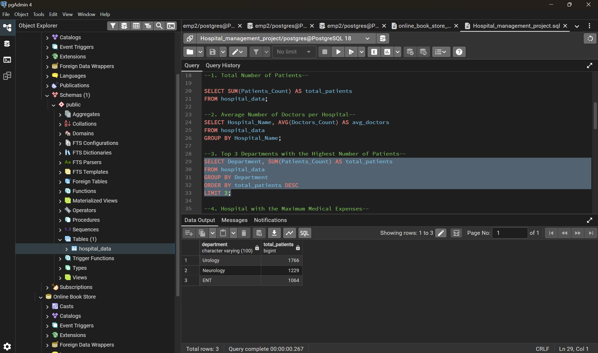

# 🏥 SQL Hospital Data Analysis

## 📌 Project Overview

This repository contains my SQL assignment completed during the **30 Days SQL Micro Course** by **Skill Course**.

The project demonstrates SQL queries used to analyze a hospital dataset and extract meaningful insights using **PostgreSQL**.

---

## 📊 SQL Concepts Used

- SELECT
- SUM()
- AVG()
- GROUP BY
- ORDER BY
- LIMIT
- TO_DATE()
- TO_CHAR()
- Aggregate Functions

---

## 📈 Key Insights

- Total Number of Patients
- Average Doctors per Hospital
- Top 3 Departments by Patient Count
- Hospital with Maximum Medical Expenses
- Daily Average Medical Expenses
- Longest Hospital Stay
- Total Patients Treated Per City
- Average Length of Stay Per Department
- Department with Lowest Number of Patients
- Monthly Medical Expenses Report

---

## 🛠️ Tools Used

- PostgreSQL
- pgAdmin 4

---

## 📂 Project Files

- `Hospital_management_project.sql`
- `30_Days_SQL_Micro_Query_Assignment_Answer.pdf`

---

# 📸 Project Screenshots

## CREATE TABLE Query

---

## Top 3 Departments Output

---

## Hospital with Maximum Medical Expenses

---

## Monthly Medical Expenses Report

---

## 👨‍💻 Author

**Shailesh Balaji Suryawanshi**
---

⭐ If you found this project helpful, feel free to star this repository.
